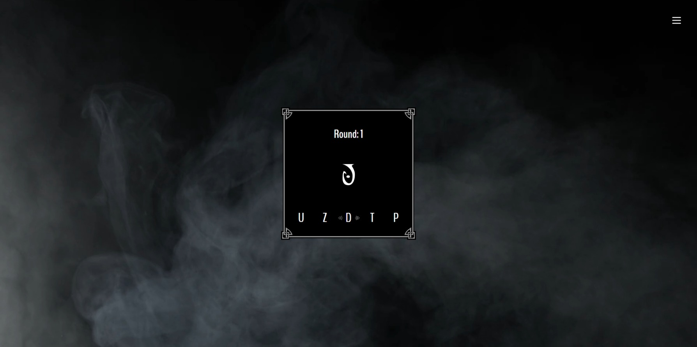
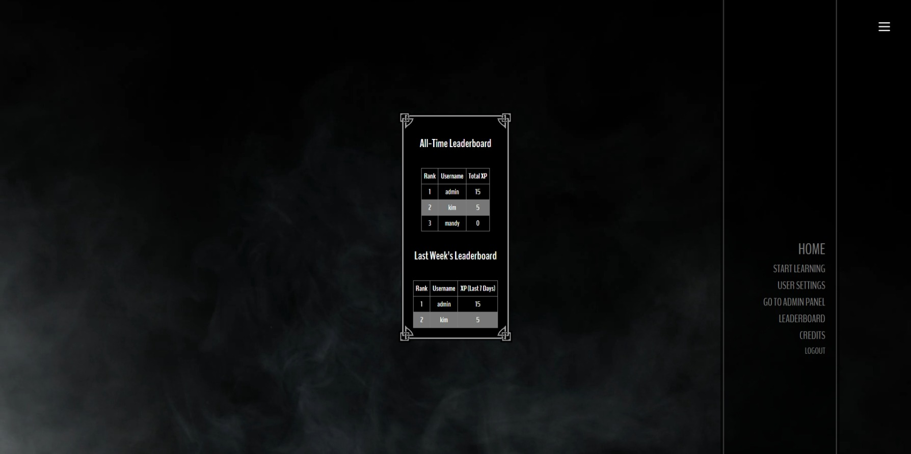

# Daedric Alphabet Learning App

[Live Demo](https://site--duodedra--y685ylx9pnrf.code.run/)

A Duolingo-style web app designed to help you learn and practice the Daedric alphabet from The Elder Scrolls series in a fun, interactive way.

## Current features:

- Symbol Matching Quiz – Choose the correct English letter from multiple choices.
- User Accounts & Login – Create an account to track your score.
- Leaderboard – Compete for the highest score (all-time & last week rankings).
- Simple & Intuitive UI – Inspired by Skyrim’s minimalist menu design.

## Tech:

- Backend: Node.js with Express.js
- Frontend: EJS templating engine
- Database: PostgreSQL

## Screenshots:

### Home Page

### Quiz Screen

### Leaderboard

